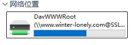
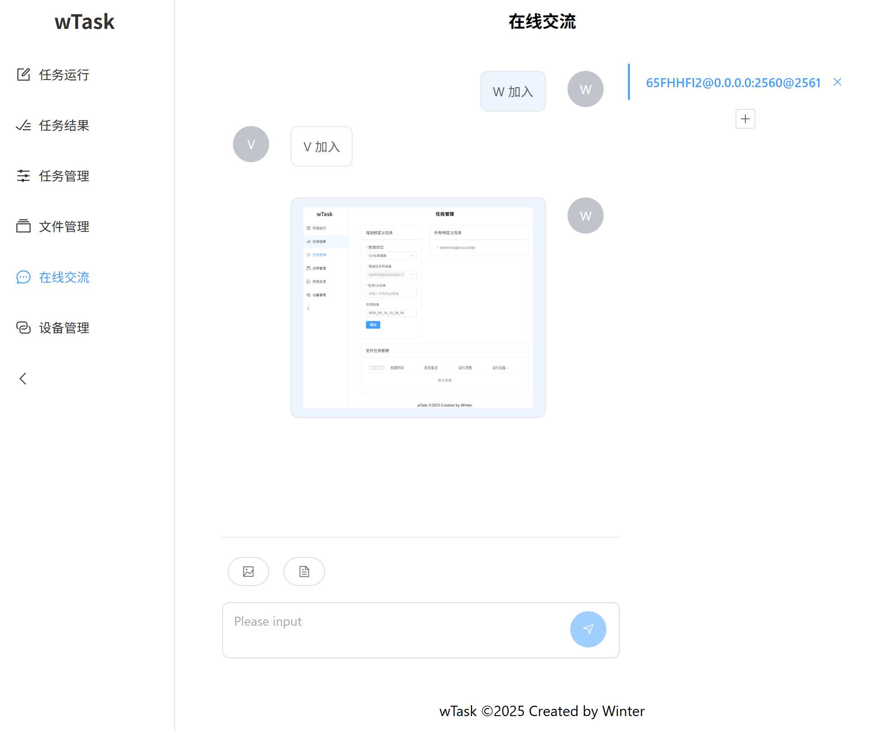
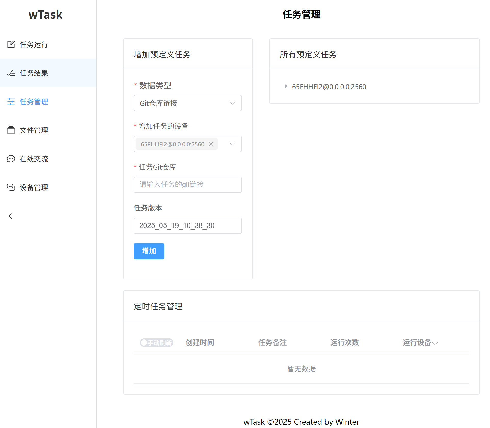

# wTask

一个安全的跨网任务通信基础平台

## 平台说明

- 本平台为通用任务调度、即时通讯、远程文件三系统合一，平台提供了端口转发、即时通讯、文件管理、任务调度（任务立即或定时运行）的功能，满足了内网人员通信的一般需求，平台统一为内网人员通信提供极大便利。当然在允许条件下该平台还可以将内网机器安全的映射到外网，方便外网人员进行安全的交流通信。

- 平台开发使用Rust结合Web技术，既保证了系统的高性能也为用户提供了简单的操作页面。

- 平台通信全程使用加密技术，保证数据安全。

- 对于组织，利用本平台任务调度可设计出非常广泛的应用系统，比如生物信息学数据分析平台、医保风控系统、服务器自动运维系统、计算中心任务调度系统等。再加上其提供非常便捷的web操作页面，可以将用户使用成本极具拉低。

- 对于个人或组织，利用本平台提供的即使通信、远程文件可以非常方便进行与他人进行安全的交流。

- 整体来说，该平台为一般平台的基础或集合体，因其后台使用纯Rust开发，保证了系统的高性能，加密技术保证了系统通信的安全，Web接口更带来了极好的用户体验。

## 程序说明

- `wtask_machine`是所有应用的基础，提供所有应用数据

- `wtask_bridge`为`wtask_machine`提供网络代理，以防万一`wtask_machine`无法直接连接

- 使用接口
    
    - `wtask_web`，提供易于操作的web页面，可简单在线使用
    
    - `wtask_cli`，为应用提供更详细的参数设置

- 开发使用Rust结合Web技术，既保证了系统的高性能也为用户提供了简单的操作页面
- 平台全程通信使用加密，保证数据安全

# 平台功能

[详细文档](./doc/Usage.md)

1. 远程端口转发

2. 远程文件读写

    - 将远程的`wtask_machine`所在设备文件系统文件包装为WebDav协议

    - 将`wtask_web`所在设备文件系统包装为WebDav协议
    
    

3. 在线聊天

    - 通过`wtask_machine`搭建临时聊天服务

    

4. 远程shell任务运行/定时运行

    

## 安装使用

0. 软件依赖：

    - `openssl-dev`: cli依赖于openssl-dev，如果只运行machine则不需要

    - `podman`: 如果安装的任务环境为shell且不是linux系统，则可以安装podman，并设置WTASK_FORCE_PODMAN=1环境变量，即可要求任务在podman容器内运行

1. 本机已安装，通过`ssh`为其它设备安装

    - 使用`wtask_cli config ssh`子命令安装

2. 全服务安装
    
    - 使用`wtask_install`安装程序安装并启动所有服务
    
    - 安装程序链接
        - [Github](https://github.com/LonlyWinter/wTask)
        - [Gitee](https://gitee.com/winter-lonely/wTask)

3. 分散部署

    - machine在多台服务器单独运行 

    - web单独在某个服务器运行 
    
    - cli在每个用户设备安装 
    
    - 如果cli或者web无法直接访问machine，则可以在中继服务器安装，并设置machine连接到该bridge 
    
    - 用户通过统一的web或者本机的cli即可访问machine上的应用资源

4. 关闭服务
    
    发送`Ctrl-C`信号，如`kill -2 PID`

## 注意事项

- machine是以用户为单位进行安装，即一个用户对应一个machine，如果一个机器上有
多个用户则需要安装多个machine，因此提供了ssh的安装方式 

- 自动安装默认安装在用户家目录下的`.wtask`文件夹下 

- 启动的machine 会自动启动本地服务及连接公网已部署的bridge(IP`120.26.192.195`，
端口`2560`)，因此可以连接该 bridge 实现公网管理内网 machine，当然可以自定义
machine 相关设置。 

- 默认端口设置：machine(根据用户ID计算)、bridge(2560)、web内连接machine webdav
服务(5005)、web 本身的webdav(8079)、web(8080)、web内的websocket(8081) 

## 应用场景

- 生信数据分析
- 医保智能监管
- 服务器自动运维
- 计算中心任务调度
- 个人文件传输
- ...

## 相关资源

- [wTaskTasks](https://github.com/LonlyWinter/wTaskTasks)    
    - 生信数据分析相关预定义任务
    - 医保风控相关预定义任务
    - 服务器自动运维相关预定义任务

- ...

## 作者

winter <winter_lonely@foxmail.com>

