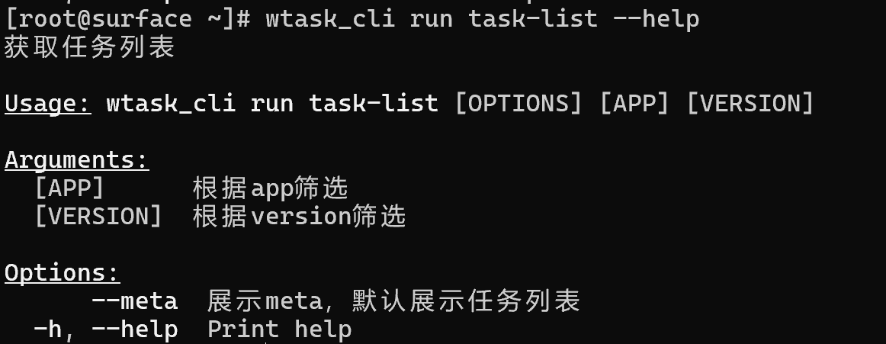
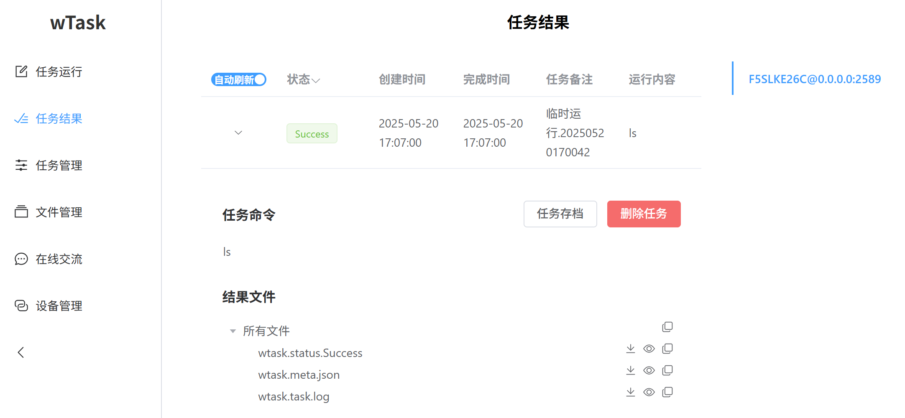

# wTask平台功能介绍

[wTask平台](https://github.com/LonlyWinter/wTask)

## 登录/设备管理

由于该平台能统一管理多个machine，因此提供单一的token登录方式，也提供配置文件一下子多设备登录，当然也提供ssh远程部署并登录的方式。

登录后的设备可以单独退出或全部退出，也可下载登录配置方便之后一下子登录多设备。
注意：设备token可以通过启动machine的日志找到，并且该token比较重要，拥有该token即可拥有该machine的所有权限，请注意保存！

如果没有任何设备登录，则回到“设备登录”页面；如果已经登录设备，还想登录其它设备，则在“设备管理”页面进行登录。当然也能通过cli命令行进行设备管理，cli设备配置保存在`wtask.config.cli.jsonl`文件中。

    
终端截图

      
    

    
Web截图

      
    

## 端口转发

提供将machine端口转发到本地端口的功能，方便用户连接machine的其它服务。

    
终端截图

    

    
Web截图

      
    

## 即时通讯

通过machine搭建临时私密聊天服务，所有数据均通过machine转发，可以进行文本、图片、文件的发送及接受。

添加会话使需要自定义用户名，默认读取上次输入的用户名。聊天信息也不进行保存，请自行保存。新进入会话的人员无法看到历史记录。聊天记录内的图片点击可以放大预览下载，文件可以点击下载。

注意machine所在机器的带宽，发送太大文件可能造成卡顿。

    
Web截图

      
    

## 文件管理

Web及cli提供简单的文件管理，如上传和下载。其中web内点击右边的眼睛图标提供部分文件格式的在线预览。

Web还提供将machine的文件管理包装为WebDav协议，可以通过WebDav协议进行文件管理，如windows直接映射网络驱动器。文件夹地址为web所在设备的地址，如http://127.0.0.1:5005，用户名为登录时的`ip@端口`，密码为`machine的token`

Web还提供将web所在机器文件管理包装为WebDav协议，可以通过WebDav协议进行文件管理，此时用户名不要求，密码为`web所在的machine token`。

注意：为了数据安装，所有文件管理均不支持删除操作

    
终端使用截图

      
      
    

    
Web管理截图

      
    

    
Windows WebDav截图

      
    

## 任务调度

### 任务创建及编辑

任务只能通过cli命令创建，创建时会提供任务的模板及创建任务的详细说明。

创建完成后可使用自己的编辑器进行编辑，编辑完成后可以上传到github/gitee等代码托管平台或者使用cli命令打包供之后上传到machine。

编辑完成后的任务可以先使用check命令检查一下语法，防止添加任务时再发现问题。

注意：创建任务时的文件夹路径包含任务名字，任务名字建议小写英文单词，单词之间使用下划线连接

    
任务模板截图

    

    
终端使用截图

      
      
    

### 任务添加

可以使用web或者cli命令进行任务添加，支持文件夹/Git/压缩的任务文件，其中压缩的任务文件版本为压缩时产生的任务版本。

任务添加时会先检查任务语法是否存在问题，之后会进行安装步骤，安装期间任务状态是禁用状态，之后自行恢复启用状态。当然也可以管理任务状态及查看所有任务。

为了批量添加任务，提供任务全部打包下载功能，当然也直接提供任务同步功能，直接将其它machine的任务同步过来。

    
终端任务管理截图

      
      
      
      
    

    
Web任务管理截图

    

### 任务运行

提供预定义任务运行或者临时系统命令运行两种方式，当然也能定时运行，也能将任务发给多台设备运行。填写预定义任务时，右边有该任务的说明。定时任务可在“任务管理”内查看。

如果machine不是linux系统则可以安装podman，并设置`WTASK_FORCE_PODMAN=1`环境变量，即可要求任务在podman容器内运行。可以通过设置`WTASK_PODMAN_BASE`环境变量设置环境的基本镜像，默认为AnolisOS镜像。

    
终端使用截图

      
      
    

    
Web定时任务管理截图

    

    
Web运行任务截图

      
    

### 任务结果

可以通过web或cli查看任务结果：任务状态、运行开始时间、运行结束时间、任务结果文件等信息。

如果该任务结果不需要，则可以删除任务。如果该任务结果还需要，则可以进行存档，这样就不会在web端的任务结果内出现，表示该任务结果已读。后续可以通过文件管理查看存档的任务结果。

    
终端使用截图

      
      
    

    
Web截图

    

## 交互式命令行

为了临时连续运行命令，提供假的简单的远程的交互式命令行，可以通过cli启动

    
终端截图

    

